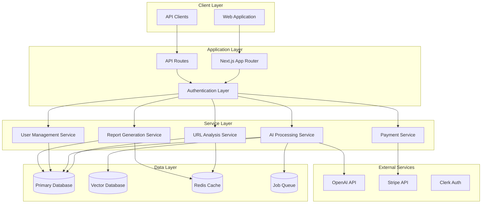

# Design Document

## Overview

LinkShield is architected as a modern, scalable web platform built on Next.js 14 with App Router, providing both traditional URL analysis and advanced AI-powered content intelligence. The system follows a microservices-inspired architecture within a monolithic Next.js application, with clear separation of concerns between core URL analysis, AI processing, user management, and reporting systems.

The platform is designed to handle high-traffic loads through strategic use of caching, background job processing, and efficient database design. The AI components are architected to be cost-effective and scalable, with intelligent caching and batching strategies to optimize OpenAI API usage.

## Architecture

### High-Level System Architecture



### Technology Stack

- **Frontend**: Next.js 14 with App Router, TypeScript, Tailwind CSS
- **Backend**: Next.js API Routes with TypeScript
- **Database**: PlanetScale (MySQL) for primary data, Pinecone for vector storage
- **Authentication**: Clerk for user management and authentication
- **Payments**: PayPal for subscription and payment processing
- **AI/ML**: OpenRouter API using Deepseek V3.1
- **Caching**: Redis (Upstash) for caching and job queuing
- **Deployment**: Vercel with edge functions
- **Monitoring**: Vercel Analytics and custom metrics

## Components and Interfaces

### Core URL Analysis Engine

```typescript
interface URLAnalysisEngine {
  // Primary analysis method
  analyzeURL(url: string, options: AnalysisOptions): Promise<URLAnalysisResult>;
  
  // Component analyzers
  checkHTTPStatus(url: string): Promise<HTTPStatusResult>;
  validateSSL(url: string): Promise<SSLValidationResult>;
  analyzeRedirects(url: string): Promise<RedirectChainResult>;
  extractMetadata(url: string): Promise<MetadataResult>;
  calculateSecurityScore(results: Partial<URLAnalysisResult>): number;
}

interface AnalysisOptions {
  includeAI?: boolean;
  timeout?: number;
  followRedirects?: boolean;
  maxRedirects?: number;
}

interface URLAnalysisResult {
  id: string;
  url: string;
  statusCode: number;
  responseTime: number;
  sslValid: boolean;
  redirectChain: RedirectInfo[];
  metadata: PageMetadata;
  securityScore: number;
  aiAnalysisId?: string;
  createdAt: Date;
}
```

### AI Content Intelligence System

```typescript
interface AIContentProcessor {
  // Main processing pipeline
  processContent(url: string, content: string): Promise<AIAnalysisResult>;
  
  // Content extraction and cleaning
  extractContent(html: string): Promise<ExtractedContent>;
  cleanContent(content: string): string;
  
  // AI analysis components
  generateEmbedding(content: string): Promise<number[]>;
  calculateQualityMetrics(content: ExtractedContent): Promise<QualityMetrics>;
  findSimilarPages(embedding: number[], limit: number): Promise<SimilarPage[]>;
  generateInsights(analysis: AIAnalysisResult): Promise<ContentInsights>;
}

interface QualityMetrics {
  readabilityScore: number; // 0-100
  contentDepthScore: number; // 0-100
  seoOptimizationScore: number; // 0-100
  originalityScore: number; // 0-100
  engagementScore: number; // 0-100
  overallQuality: number; // Weighted average
}

interface SimilarPage {
  id: string;
  url: string;
  title: string;
  similarityScore: number; // 0-1
  similarityType: 'semantic' | 'structural' | 'topical';
  comparisonMetadata: Record<string, any>;
}
```

### User Management and Authentication

```typescript
interface UserManagementService {
  // User lifecycle
  createUser(userData: CreateUserData): Promise<User>;
  updateUser(userId: string, updates: Partial<User>): Promise<User>;
  deleteUser(userId: string): Promise<void>;
  
  // Usage tracking
  trackUsage(userId: string, action: UsageAction): Promise<void>;
  checkUsageLimits(userId: string): Promise<UsageLimitResult>;
  resetMonthlyUsage(userId: string): Promise<void>;
  
  // Plan management
  upgradePlan(userId: string, planId: string): Promise<void>;
  downgradePlan(userId: string, planId: string): Promise<void>;
}

interface UsageLimitResult {
  canPerformAction: boolean;
  currentUsage: number;
  limit: number;
  resetDate: Date;
  upgradeRequired?: boolean;
}
```

### Report Generation System

```typescript
interface ReportGenerator {
  // Report creation
  generateReport(analysisId: string, options: ReportOptions): Promise<Report>;
  generatePublicReport(analysisId: string): Promise<PublicReport>;
  
  // Report sharing
  createShareableLink(reportId: string): Promise<string>;
  trackReportView(reportId: string, metadata: ViewMetadata): Promise<void>;
  
  // Report formatting
  formatForPrint(report: Report): Promise<PrintableReport>;
  generateSocialPreview(report: Report): Promise<SocialPreviewData>;
}

interface ReportOptions {
  includeAIInsights: boolean;
  includeSimilarPages: boolean;
  includeCompetitiveAnalysis: boolean;
  branding: BrandingOptions;
}
```

## Data Models

### Primary Database Schema

```sql
-- Users table with plan and usage tracking
CREATE TABLE users (
  id VARCHAR(36) PRIMARY KEY,
  clerk_user_id VARCHAR(255) UNIQUE NOT NULL,
  email VARCHAR(255) UNIQUE NOT NULL,
  name VARCHAR(255),
  plan ENUM('free', 'pro', 'enterprise') DEFAULT 'free',
  checks_used_this_month INT DEFAULT 0,
  ai_analyses_used_this_month INT DEFAULT 0,
  plan_expires_at DATETIME,
  stripe_customer_id VARCHAR(255),
  created_at DATETIME DEFAULT CURRENT_TIMESTAMP,
  updated_at DATETIME DEFAULT CURRENT_TIMESTAMP ON UPDATE CURRENT_TIMESTAMP,
  INDEX idx_clerk_user_id (clerk_user_id),
  INDEX idx_email (email),
  INDEX idx_plan (plan)
);

-- URL checks with comprehensive analysis results
CREATE TABLE checks (
  id VARCHAR(36) PRIMARY KEY,
  user_id VARCHAR(36),
  url TEXT NOT NULL,
  url_hash VARCHAR(64) NOT NULL, -- SHA-256 for deduplication
  status_code INT,
  response_time_ms INT,
  ssl_valid BOOLEAN,
  redirect_chain JSON,
  meta_data JSON,
  security_score INT,
  ai_analysis_id VARCHAR(36),
  is_public BOOLEAN DEFAULT FALSE,
  created_at DATETIME DEFAULT CURRENT_TIMESTAMP,
  FOREIGN KEY (user_id) REFERENCES users(id) ON DELETE CASCADE,
  FOREIGN KEY (ai_analysis_id) REFERENCES ai_analyses(id),
  INDEX idx_user_id (user_id),
  INDEX idx_url_hash (url_hash),
  INDEX idx_created_at (created_at),
  INDEX idx_public (is_public)
);

-- AI analyses with vector embeddings and quality metrics
CREATE TABLE ai_analyses (
  id VARCHAR(36) PRIMARY KEY,
  url TEXT NOT NULL,
  content_hash VARCHAR(64) UNIQUE NOT NULL,
  content_summary TEXT,
  content_embedding JSON, -- Stored as JSON array
  quality_metrics JSON,
  topic_categories JSON,
  keyword_density JSON,
  content_length INT,
  language VARCHAR(10),
  processing_status ENUM('pending', 'processing', 'completed', 'failed') DEFAULT 'pending',
  error_message TEXT,
  created_at DATETIME DEFAULT CURRENT_TIMESTAMP,
  updated_at DATETIME DEFAULT CURRENT_TIMESTAMP ON UPDATE CURRENT_TIMESTAMP,
  INDEX idx_content_hash (content_hash),
  INDEX idx_processing_status (processing_status),
  INDEX idx_created_at (created_at)
);

-- Similar pages relationships with similarity scores
CREATE TABLE similar_pages (
  id VARCHAR(36) PRIMARY KEY,
  source_analysis_id VARCHAR(36) NOT NULL,
  target_analysis_id VARCHAR(36) NOT NULL,
  similarity_score DECIMAL(4,3) NOT NULL, -- 0.000 to 1.000
  similarity_type ENUM('semantic', 'structural', 'topical') NOT NULL,
  comparison_metadata JSON,
  created_at DATETIME DEFAULT CURRENT_TIMESTAMP,
  FOREIGN KEY (source_analysis_id) REFERENCES ai_analyses(id) ON DELETE CASCADE,
  FOREIGN KEY (target_analysis_id) REFERENCES ai_analyses(id) ON DELETE CASCADE,
  UNIQUE KEY unique_comparison (source_analysis_id, target_analysis_id),
  INDEX idx_source_analysis (source_analysis_id),
  INDEX idx_similarity_score (similarity_score DESC)
);

-- Subscription plans configuration
CREATE TABLE plans (
  id VARCHAR(36) PRIMARY KEY,
  name VARCHAR(50) NOT NULL,
  checks_per_month INT NOT NULL,
  ai_analyses_per_month INT NOT NULL,
  price_monthly INT, -- in cents
  features JSON,
  stripe_price_id VARCHAR(255),
  is_active BOOLEAN DEFAULT TRUE,
  created_at DATETIME DEFAULT CURRENT_TIMESTAMP
);

-- Report sharing and analytics
CREATE TABLE report_views (
  id VARCHAR(36) PRIMARY KEY,
  check_id VARCHAR(36) NOT NULL,
  viewer_ip VARCHAR(45),
  user_agent TEXT,
  referrer TEXT,
  country VARCHAR(2),
  created_at DATETIME DEFAULT CURRENT_TIMESTAMP,
  FOREIGN KEY (check_id) REFERENCES checks(id) ON DELETE CASCADE,
  INDEX idx_check_id (check_id),
  INDEX idx_created_at (created_at)
);
```

### Vector Database Schema (Pinecone)

```typescript
interface VectorRecord {
  id: string; // ai_analysis_id
  values: number[]; // 1536-dimensional embedding
  metadata: {
    url: string;
    title: string;
    contentHash: string;
    qualityScore: number;
    topicCategories: string[];
    language: string;
    createdAt: string;
  };
}
```

## Error Handling

### Error Classification System

```typescript
enum ErrorType {
  VALIDATION_ERROR = 'VALIDATION_ERROR',
  NETWORK_ERROR = 'NETWORK_ERROR',
  TIMEOUT_ERROR = 'TIMEOUT_ERROR',
  RATE_LIMIT_ERROR = 'RATE_LIMIT_ERROR',
  AI_PROCESSING_ERROR = 'AI_PROCESSING_ERROR',
  PAYMENT_ERROR = 'PAYMENT_ERROR',
  AUTHENTICATION_ERROR = 'AUTHENTICATION_ERROR',
  AUTHORIZATION_ERROR = 'AUTHORIZATION_ERROR',
  INTERNAL_ERROR = 'INTERNAL_ERROR'
}

interface ErrorResponse {
  success: false;
  error: {
    type: ErrorType;
    message: string;
    code: string;
    details?: Record<string, any>;
    retryable: boolean;
    retryAfter?: number;
  };
}
```

### Error Handling Strategies

1. **URL Analysis Errors**:
   - Network timeouts: Retry with exponential backoff
   - Invalid URLs: Return validation errors immediately
   - SSL errors: Continue with warning flags
   - Rate limiting: Queue for later processing

2. **AI Processing Errors**:
   - OpenAI API failures: Retry with different models
   - Embedding generation failures: Fall back to basic analysis
   - Vector database errors: Cache locally and retry
   - Content extraction failures: Use alternative parsers

3. **Payment Processing Errors**:
   - Failed payments: Provide grace period and retry
   - Webhook failures: Implement idempotent processing
   - Plan changes: Ensure atomic updates

4. **Authentication Errors**:
   - Invalid tokens: Clear session and redirect to login
   - Expired sessions: Refresh tokens automatically
   - Permission errors: Show upgrade prompts

## Testing Strategy

### Unit Testing

```typescript
// URL Analysis Engine Tests
describe('URLAnalysisEngine', () => {
  test('should analyze valid HTTPS URL successfully', async () => {
    const result = await urlAnalyzer.analyzeURL('https://example.com');
    expect(result.statusCode).toBe(200);
    expect(result.sslValid).toBe(true);
    expect(result.securityScore).toBeGreaterThan(70);
  });

  test('should handle network timeouts gracefully', async () => {
    const result = await urlAnalyzer.analyzeURL('https://timeout-test.com', {
      timeout: 1000
    });
    expect(result.error?.type).toBe(ErrorType.TIMEOUT_ERROR);
  });
});

// AI Processing Tests
describe('AIContentProcessor', () => {
  test('should generate quality metrics for valid content', async () => {
    const content = 'Sample article content...';
    const metrics = await aiProcessor.calculateQualityMetrics(content);
    expect(metrics.readabilityScore).toBeGreaterThan(0);
    expect(metrics.overallQuality).toBeLessThanOrEqual(100);
  });

  test('should find similar pages based on embeddings', async () => {
    const embedding = new Array(1536).fill(0.1);
    const similar = await aiProcessor.findSimilarPages(embedding, 5);
    expect(similar).toHaveLength(5);
    expect(similar[0].similarityScore).toBeGreaterThan(0);
  });
});
```

### Integration Testing

```typescript
// API Endpoint Tests
describe('API Integration', () => {
  test('POST /api/check should analyze URL and return results', async () => {
    const response = await request(app)
      .post('/api/check')
      .send({ url: 'https://example.com' })
      .expect(200);
    
    expect(response.body.success).toBe(true);
    expect(response.body.data.id).toBeDefined();
    expect(response.body.data.securityScore).toBeGreaterThan(0);
  });

  test('should enforce rate limits for free users', async () => {
    // Simulate multiple requests from free user
    for (let i = 0; i < 6; i++) {
      const response = await request(app)
        .post('/api/check')
        .set('Authorization', `Bearer ${freeUserToken}`)
        .send({ url: `https://example${i}.com` });
      
      if (i < 5) {
        expect(response.status).toBe(200);
      } else {
        expect(response.status).toBe(429);
        expect(response.body.error.type).toBe(ErrorType.RATE_LIMIT_ERROR);
      }
    }
  });
});
```

### End-to-End Testing

```typescript
// User Journey Tests
describe('User Journeys', () => {
  test('complete user registration and URL analysis flow', async () => {
    // 1. User registration
    await page.goto('/signup');
    await page.fill('[data-testid="email"]', 'test@example.com');
    await page.fill('[data-testid="password"]', 'password123');
    await page.click('[data-testid="signup-button"]');
    
    // 2. URL analysis
    await page.goto('/');
    await page.fill('[data-testid="url-input"]', 'https://example.com');
    await page.click('[data-testid="analyze-button"]');
    
    // 3. Results verification
    await page.waitForSelector('[data-testid="analysis-results"]');
    const securityScore = await page.textContent('[data-testid="security-score"]');
    expect(parseInt(securityScore)).toBeGreaterThan(0);
    
    // 4. Report sharing
    await page.click('[data-testid="share-report"]');
    const shareUrl = await page.getAttribute('[data-testid="share-url"]', 'value');
    expect(shareUrl).toContain('/report/');
  });
});
```

### Performance Testing

```typescript
// Load Testing Configuration
const loadTestConfig = {
  scenarios: {
    url_analysis: {
      executor: 'ramping-vus',
      startVUs: 0,
      stages: [
        { duration: '2m', target: 100 },
        { duration: '5m', target: 100 },
        { duration: '2m', target: 200 },
        { duration: '5m', target: 200 },
        { duration: '2m', target: 0 }
      ]
    }
  },
  thresholds: {
    http_req_duration: ['p(95)<2000'], // 95% of requests under 2s
    http_req_failed: ['rate<0.01'], // Error rate under 1%
  }
};
```

This design provides a comprehensive foundation for building the LinkShield platform with proper separation of concerns, scalable architecture, robust error handling, and thorough testing strategies. The system is designed to handle both the core URL analysis functionality and the advanced AI-powered content intelligence features while maintaining performance and reliability.