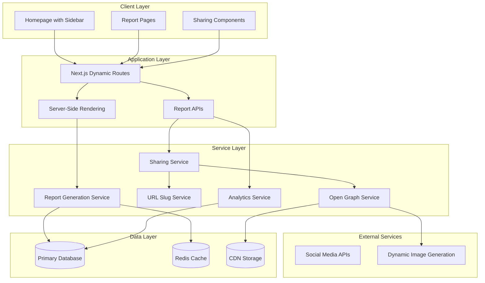

# Design Document

## Overview

The Shareable Reports System is designed as a viral marketing engine that transforms individual URL analyses into shareable, SEO-optimized content. The system consists of three main components: public report pages with friendly URLs, native sharing functionality, and a real-time recent reports sidebar. The architecture emphasizes performance, social media optimization, and viral growth while maintaining user privacy controls.

The system leverages Next.js dynamic routing, server-side rendering for SEO, and efficient caching strategies to handle viral traffic loads. Social media integration includes dynamic Open Graph image generation and Web Share API integration for seamless sharing experiences.

## Architecture

### High-Level System Architecture



### URL Structure Design

```typescript
interface ReportURL {
  // Public shareable format
  pattern: '/reports/{site-slug}-{unique-id}';
  examples: [
    '/reports/google-com-abc123',
    '/reports/github-com-def456',
    '/reports/stackoverflow-com-ghi789'
  ];
}

interface SlugGeneration {
  // Site slug creation from URL
  generateSiteSlug(url: string): string;
  // Examples:
  // https://www.google.com -> google-com
  // https://api.github.com/users -> api-github-com-users
  // https://stackoverflow.com/questions/123 -> stackoverflow-com-questions
}
```

## Components and Interfaces

### Report Generation and Sharing Service

```typescript
interface ShareableReportService {
  // Report creation and management
  createShareableReport(checkId: string, options: ShareOptions): Promise<ShareableReport>;
  getReportBySlug(slug: string): Promise<ShareableReport | null>;
  updateReportPrivacy(reportId: string, isPublic: boolean): Promise<void>;
  
  // URL and slug management
  generateReportSlug(url: string, checkId: string): string;
  validateSlugUniqueness(slug: string): Promise<boolean>;
  
  // Social sharing
  generateShareData(report: ShareableReport): ShareData;
  trackShareEvent(reportId: string, shareMethod: ShareMethod): Promise<void>;
}

interface ShareableReport {
  id: string;
  checkId: string;
  slug: string; // e.g., "google-com-abc123"
  url: string;
  title: string;
  description: string;
  securityScore: number;
  isPublic: boolean;
  analysisData: {
    statusCode: number;
    responseTime: number;
    sslValid: boolean;
    redirectChain: RedirectInfo[];
    metadata: PageMetadata;
    aiInsights?: AIInsights;
  };
  socialPreview: {
    ogImageUrl: string;
    ogTitle: string;
    ogDescription: string;
  };
  createdAt: Date;
  viewCount: number;
  shareCount: number;
}

interface ShareOptions {
  isPublic: boolean;
  includeAIInsights: boolean;
  customTitle?: string;
  customDescription?: string;
}

interface ShareData {
  url: string;
  title: string;
  text: string;
  hashtags: string[];
  via: string; // "LinkShield"
}
```

### Recent Reports Sidebar Component

```typescript
interface RecentReportsSidebar {
  // Data fetching
  getRecentReports(limit: number): Promise<RecentReport[]>;
  subscribeToRealtimeUpdates(): EventSource;
  
  // Display management
  formatReportForDisplay(report: RecentReport): DisplayReport;
  getScoreColorClass(score: number): string;
  
  // Interaction handling
  handleReportClick(reportSlug: string): void;
  trackSidebarInteraction(action: SidebarAction): void;
}

interface RecentReport {
  slug: string;
  url: string;
  domain: string;
  securityScore: number;
  createdAt: Date;
  isAIAnalyzed: boolean;
}

interface DisplayReport {
  slug: string;
  displayUrl: string; // Truncated for display
  domain: string;
  securityScore: number;
  scoreColor: 'green' | 'yellow' | 'orange' | 'red';
  timeAgo: string; // "2 minutes ago"
  hasAI: boolean;
}

// Color coding system
const SCORE_COLORS = {
  excellent: { range: [80, 100], color: 'green', class: 'text-green-600' },
  good: { range: [60, 79], color: 'yellow', class: 'text-yellow-600' },
  warning: { range: [40, 59], color: 'orange', class: 'text-orange-600' },
  danger: { range: [0, 39], color: 'red', class: 'text-red-600' }
};
```

### Native Sharing Integration

```typescript
interface NativeSharingService {
  // Web Share API integration
  isNativeSharingSupported(): boolean;
  shareNatively(shareData: ShareData): Promise<void>;
  
  // Fallback sharing methods
  copyToClipboard(url: string): Promise<boolean>;
  generateQRCode(url: string): Promise<string>;
  
  // Social platform specific sharing
  shareToTwitter(shareData: ShareData): string;
  shareToLinkedIn(shareData: ShareData): string;
  shareToFacebook(shareData: ShareData): string;
  
  // Analytics
  trackShareAttempt(method: ShareMethod, success: boolean): void;
}

interface ShareMethod {
  type: 'native' | 'copy' | 'qr' | 'twitter' | 'linkedin' | 'facebook' | 'email';
  platform?: string;
  userAgent?: string;
}
```

### Open Graph and SEO Service

```typescript
interface OpenGraphService {
  // Dynamic image generation
  generateOGImage(report: ShareableReport): Promise<string>;
  cacheOGImage(reportId: string, imageUrl: string): Promise<void>;
  
  // Meta tag generation
  generateMetaTags(report: ShareableReport): MetaTags;
  generateStructuredData(report: ShareableReport): StructuredData;
  
  // SEO optimization
  generateCanonicalUrl(slug: string): string;
  generateRobotsMeta(report: ShareableReport): string;
}

interface MetaTags {
  title: string;
  description: string;
  canonical: string;
  ogTitle: string;
  ogDescription: string;
  ogImage: string;
  ogUrl: string;
  ogType: 'website';
  twitterCard: 'summary_large_image';
  twitterTitle: string;
  twitterDescription: string;
  twitterImage: string;
  robots: string;
}

interface StructuredData {
  '@context': 'https://schema.org';
  '@type': 'WebPage' | 'Report';
  name: string;
  description: string;
  url: string;
  datePublished: string;
  author: {
    '@type': 'Organization';
    name: 'LinkShield';
  };
  about: {
    '@type': 'WebSite';
    url: string;
  };
}
```

## Data Models

### Database Schema Extensions

```sql
-- Extend existing checks table with sharing fields
ALTER TABLE checks ADD COLUMN slug VARCHAR(255) UNIQUE;
ALTER TABLE checks ADD COLUMN share_count INT DEFAULT 0;
ALTER TABLE checks ADD COLUMN og_image_url TEXT;
ALTER TABLE checks ADD COLUMN custom_title VARCHAR(255);
ALTER TABLE checks ADD COLUMN custom_description TEXT;

-- Create indexes for performance
CREATE INDEX idx_checks_slug ON checks(slug);
CREATE INDEX idx_checks_public_created ON checks(is_public, created_at DESC);

-- Social sharing analytics table
CREATE TABLE share_events (
  id VARCHAR(36) PRIMARY KEY,
  check_id VARCHAR(36) NOT NULL,
  share_method VARCHAR(50) NOT NULL, -- native, copy, twitter, etc.
  success BOOLEAN NOT NULL,
  user_agent TEXT,
  referrer TEXT,
  ip_address VARCHAR(45),
  created_at DATETIME DEFAULT CURRENT_TIMESTAMP,
  
  FOREIGN KEY (check_id) REFERENCES checks(id) ON DELETE CASCADE,
  INDEX idx_check_id (check_id),
  INDEX idx_created_at (created_at),
  INDEX idx_share_method (share_method)
);

-- Recent reports view for performance
CREATE VIEW recent_public_reports AS
SELECT 
  id,
  slug,
  url,
  security_score,
  created_at,
  ai_analysis_id IS NOT NULL as has_ai_analysis
FROM checks 
WHERE is_public = true 
  AND slug IS NOT NULL
ORDER BY created_at DESC;
```

### Slug Generation Algorithm

```typescript
class SlugGenerator {
  generateSlug(url: string, checkId: string): string {
    // 1. Extract domain and path
    const urlObj = new URL(url);
    const domain = urlObj.hostname.replace('www.', '');
    const pathSegments = urlObj.pathname
      .split('/')
      .filter(segment => segment.length > 0)
      .slice(0, 2); // Take first 2 path segments
    
    // 2. Create base slug
    const domainSlug = domain.replace(/\./g, '-');
    const pathSlug = pathSegments.join('-');
    const baseSlug = pathSlug ? `${domainSlug}-${pathSlug}` : domainSlug;
    
    // 3. Add unique identifier
    const shortId = checkId.slice(-6); // Last 6 chars of UUID
    
    // 4. Clean and validate
    const cleanSlug = this.cleanSlug(`${baseSlug}-${shortId}`);
    
    return cleanSlug;
  }
  
  private cleanSlug(slug: string): string {
    return slug
      .toLowerCase()
      .replace(/[^a-z0-9-]/g, '-')
      .replace(/-+/g, '-')
      .replace(/^-|-$/g, '')
      .substring(0, 100); // Limit length
  }
}

// Examples:
// https://www.google.com -> google-com-abc123
// https://github.com/user/repo -> github-com-user-def456
// https://api.example.com/v1/users -> api-example-com-v1-ghi789
```

## Error Handling

### Error Types and Handling

```typescript
enum ShareableReportError {
  SLUG_GENERATION_FAILED = 'SLUG_GENERATION_FAILED',
  REPORT_NOT_FOUND = 'REPORT_NOT_FOUND',
  REPORT_PRIVATE = 'REPORT_PRIVATE',
  OG_IMAGE_GENERATION_FAILED = 'OG_IMAGE_GENERATION_FAILED',
  SHARING_NOT_SUPPORTED = 'SHARING_NOT_SUPPORTED',
  RATE_LIMIT_EXCEEDED = 'RATE_LIMIT_EXCEEDED'
}

interface ErrorHandlingStrategy {
  // Report access errors
  handleReportNotFound(): NextResponse;
  handlePrivateReport(): NextResponse;
  
  // Sharing errors
  handleSharingFailure(method: ShareMethod, error: Error): void;
  handleOGImageFailure(reportId: string): string; // Return fallback image
  
  // Performance errors
  handleHighTraffic(): NextResponse;
  handleCacheFailure(): void;
}
```

## Testing Strategy

### Component Testing

```typescript
// Shareable Report Component Tests
describe('ShareableReportPage', () => {
  test('should render report with correct security score color', async () => {
    const report = createMockReport({ securityScore: 85 });
    render(<ShareableReportPage report={report} />);
    
    const scoreElement = screen.getByTestId('security-score');
    expect(scoreElement).toHaveClass('text-green-600');
    expect(scoreElement).toHaveTextContent('85');
  });

  test('should generate correct Open Graph meta tags', async () => {
    const report = createMockReport({ url: 'https://example.com' });
    const { container } = render(<ShareableReportPage report={report} />);
    
    const ogTitle = container.querySelector('meta[property="og:title"]');
    expect(ogTitle).toHaveAttribute('content', expect.stringContaining('Security Report'));
  });
});

// Recent Reports Sidebar Tests
describe('RecentReportsSidebar', () => {
  test('should display recent reports with correct color coding', async () => {
    const reports = [
      createMockRecentReport({ securityScore: 90 }),
      createMockRecentReport({ securityScore: 45 }),
      createMockRecentReport({ securityScore: 25 })
    ];
    
    render(<RecentReportsSidebar reports={reports} />);
    
    const scores = screen.getAllByTestId('report-score');
    expect(scores[0]).toHaveClass('text-green-600');
    expect(scores[1]).toHaveClass('text-orange-600');
    expect(scores[2]).toHaveClass('text-red-600');
  });

  test('should handle empty state gracefully', () => {
    render(<RecentReportsSidebar reports={[]} />);
    expect(screen.getByText(/no recent reports/i)).toBeInTheDocument();
  });
});
```

### Integration Testing

```typescript
// API Route Tests
describe('/api/reports/[slug]', () => {
  test('should return report data for valid public slug', async () => {
    const report = await createTestReport({ isPublic: true });
    
    const response = await request(app)
      .get(`/api/reports/${report.slug}`)
      .expect(200);
    
    expect(response.body.success).toBe(true);
    expect(response.body.data.securityScore).toBeDefined();
  });

  test('should return 404 for private reports accessed without auth', async () => {
    const report = await createTestReport({ isPublic: false });
    
    await request(app)
      .get(`/api/reports/${report.slug}`)
      .expect(404);
  });
});

// Sharing Functionality Tests
describe('Sharing Integration', () => {
  test('should track share events correctly', async () => {
    const report = await createTestReport();
    
    await request(app)
      .post(`/api/reports/${report.slug}/share`)
      .send({ method: 'twitter' })
      .expect(200);
    
    const shareEvents = await getShareEvents(report.id);
    expect(shareEvents).toHaveLength(1);
    expect(shareEvents[0].shareMethod).toBe('twitter');
  });
});
```

### Performance Testing

```typescript
// Load Testing for Viral Traffic
const viralTrafficTest = {
  scenarios: {
    report_viewing: {
      executor: 'ramping-vus',
      startVUs: 0,
      stages: [
        { duration: '1m', target: 50 },
        { duration: '5m', target: 500 },
        { duration: '2m', target: 1000 },
        { duration: '5m', target: 1000 },
        { duration: '2m', target: 0 }
      ]
    }
  },
  thresholds: {
    http_req_duration: ['p(95)<1000'], // 95% under 1s
    http_req_failed: ['rate<0.01'], // Error rate under 1%
  }
};
```

This design provides a comprehensive foundation for building viral shareable reports with excellent performance, SEO optimization, and user experience. The system is architected to handle viral traffic while maintaining fast load times and providing rich social media integration.