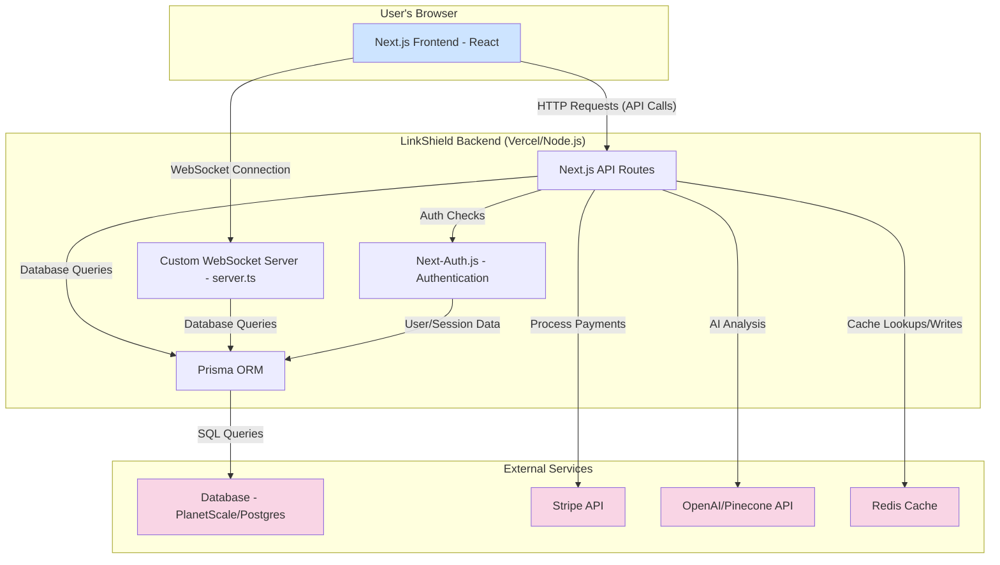

# LinkShield System Architecture

This document outlines the high-level architecture of the LinkShield application, detailing the core components and their interactions.

## Technology Stack

LinkShield is built on a modern, robust technology stack designed for scalability and performance.

- **Frontend Framework:** [Next.js](https://nextjs.org/) 14/15 (React)
- **Backend:** Node.js with a custom server (`server.ts`) using `tsx` and Express-like patterns, alongside Next.js API Routes.
- **Real-time Communication:** WebSockets are implemented using [Socket.IO](https://socket.io/).
- **Database ORM:** [Prisma](https://www.prisma.io/)
- **Database:** PlanetScale (MySQL) / PostgreSQL (as per project context)
- **Authentication:** [Next-Auth.js](https://next-auth.js.org/)
- **UI Components:** [shadcn/ui](https://ui.shadcn.com/) and Radix UI
- **Styling:** [Tailwind CSS](https://tailwindcss.com/)
- **Payment Processing:** [Stripe](https://stripe.com/)
- **AI & Machine Learning:** OpenAI and Pinecone for advanced analysis features.
- **Caching:** Redis for performance optimization.
- **Testing:** Vitest for unit and integration testing.
- **Schema Validation:** Zod for type-safe data validation.

## Architecture Diagram

The following diagram illustrates the primary components of the LinkShield system and how they interact with each other and with external services.

## Component Overview

### 1. Frontend (Next.js)
- **Description:** A server-side rendered (SSR) and static site generated (SSG) React application. It handles all user interface elements, client-side logic, and state management.
- **Key Files:**
  - `src/app/` (App Router structure)
  - `src/components/` (Reusable UI components)
  - `src/lib/utils.ts` (Client-side utilities)

### 2. Backend (Next.js API Routes & Custom Server)
- **Description:** The backend is a hybrid system. Standard RESTful API endpoints for actions like CRUD operations, URL checks, and payment initiation are handled by **Next.js API Routes**. Real-time features, such as live report updates or notifications, are managed by a separate **Custom WebSocket Server**.
- **Key Files:**
  - `src/app/api/` (API Routes)
  - `server.ts` (Custom WebSocket server logic)
  - `src/lib/` (Shared business logic)

### 3. Authentication (Next-Auth.js)
- **Description:** Handles user sign-up, sign-in, session management, and credential/provider-based authentication. It is tightly integrated with the Prisma adapter to store user data.
- **Key Files:**
  - `src/lib/auth.ts`
  - `src/app/api/auth/[...nextauth]/route.ts`

### 4. Database (Prisma & PlanetScale/Postgres)
- **Description:** Prisma serves as the Object-Relational Mapper (ORM), providing a type-safe interface to the database. It manages all data models, including users, reports, subscriptions, and shareable links.
- **Key Files:**
  - `prisma/schema.prisma` (Database schema definition)
  - `lib/db.ts` (Prisma client instance)

### 5. External Services
- **Stripe:** Manages all payment-related activities, including creating checkout sessions, handling webhooks for subscription status changes, and managing customer billing.
- **OpenAI/Pinecone:** Provides the AI-powered analysis for URLs. These services are called by the backend to enrich the generated reports.
- **Redis:** Used as a caching layer to store frequently accessed data, such as completed report analyses or user session information, reducing database load and improving response times.
