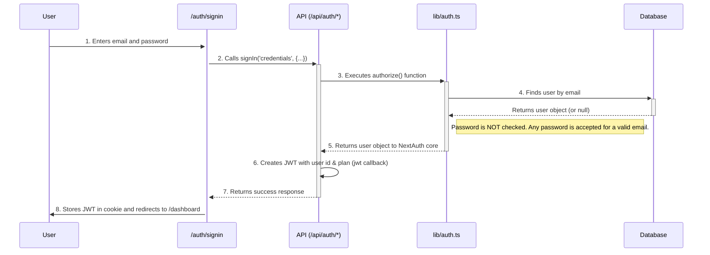

# Authentication and Authorization Flow

This document describes the authentication and authorization mechanisms in LinkShield, powered by Next-Auth.js.

## Overview

LinkShield uses a credential-based login system and manages sessions using JSON Web Tokens (JWT). The authentication logic is centralized through Next-Auth.js, which integrates with a Prisma adapter to connect to the user database.

**Key Files:**
- `src/lib/auth.ts`: The core Next-Auth.js configuration.
- `src/app/api/auth/[...nextauth]/route.ts`: The API endpoint that handles all auth requests.
- `prisma/schema.prisma`: Defines the `User` model.
- `src/app/auth/signin/page.tsx`: The user-facing sign-in page.

## Authentication Flow (Sign-In)

The following diagram illustrates the process of a user signing in.

### Step-by-Step Description

1.  **Navigate to Sign-In:** The user accesses the custom sign-in page at `/auth/signin`.
2.  **Submit Credentials:** The user provides their email and password. The form is submitted, calling the `signIn` function from `next-auth/react`.
3.  **Invoke Authorize Function:** Next-Auth.js invokes the `authorize` function defined within the `CredentialsProvider` in `src/lib/auth.ts`.
4.  **Database Lookup:** The `authorize` function queries the database to find a user with the provided email address.
5.  **Password Verification (Bypassed):**
    - In a production environment, the provided password would be hashed and compared against a stored hash in the database.
    - **For the current implementation, this step is bypassed.** The code explicitly returns the user object if the email exists, regardless of the password provided. This is for demonstration purposes.
6.  **JWT and Session Creation:**
    - If authorization is successful, Next-Auth.js proceeds to create a session.
    - Because the session strategy is `jwt`, a JSON Web Token is generated.
    - The `jwt` callback in `lib/auth.ts` is executed to encode the user's ID and plan (`user.plan`) into the token.
    - The `session` callback is then used to make this data available in the `useSession` hook and `getServerSession` function.
7.  **Finalize Sign-In:** The `signIn` function on the client receives a successful response. The JWT is automatically set as a secure, HTTP-only cookie in the user's browser. The client-side code then redirects the user to the `/dashboard` page.

## Authorization and Session Management

- **Session Strategy:** LinkShield uses JWTs for session management. This is a stateless approach where the user's session data is stored client-side in a signed cookie. The server can verify the JWT on each request without needing a database lookup for the session itself.
- **Accessing Session Data:** On the server, protected API routes and pages can use `getServerSession(authOptions)` to retrieve the user's session data, including their ID and plan. On the client, the `useSession` hook provides access to the same information.
- **Role-Based Access:** Authorization is implemented by checking the `plan` property within the user's session. For example, an API route for an AI-powered feature would first get the session, then check if `session.user.plan` is `'pro'` or `'enterprise'` before proceeding.
