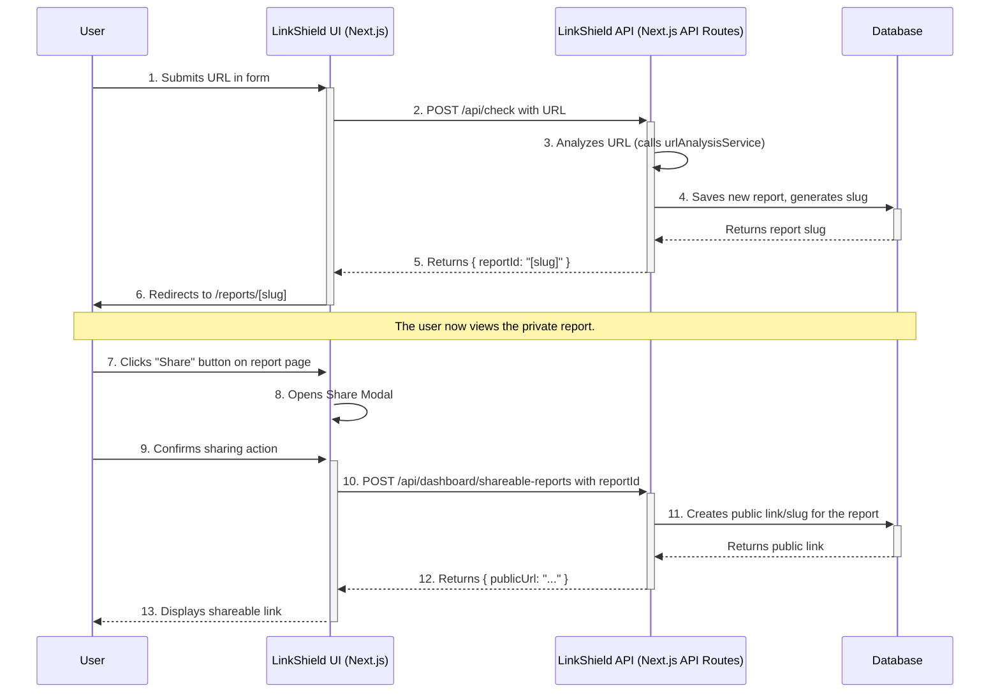

# User Workflows

This document details the primary user workflows within the LinkShield application, from creating a report to sharing it publicly.

## Main Workflow: URL Analysis and Sharing

This workflow is the core function of LinkShield. It allows users to submit a URL, receive a detailed security and health analysis, and then share that report with others.

### Workflow Diagram

### Step-by-Step Description

1.  **URL Submission:**
    - A user, either a guest or logged-in, navigates to the homepage (`/`) or their dashboard (`/dashboard`).
    - They enter a URL into the analysis form and submit it.
    - **Files:** `src/app/page.tsx`, `src/app/dashboard/page.tsx`

2.  **API Request to `/api/check`:**
    - The frontend sends a `POST` request to the `/api/check` endpoint containing the URL to be analyzed.
    - **File:** `src/app/api/check/route.ts`

3.  **Backend Analysis:**
    - The backend receives the request.
    - It invokes the `urlAnalysisService` to perform the security and health checks.
    - If the user is authenticated, the resulting report is associated with their user ID.

4.  **Database Interaction:**
    - The analysis result is stored as a new report in the database.
    - A unique `slug` (or ID) is generated for this report.
    - **File:** `lib/services/url-analysis.ts` (assumed), `prisma/schema.prisma`

5.  **API Response and Redirection:**
    - The API responds to the frontend with the unique `reportId` (slug).
    - The frontend uses this ID to redirect the user to the report page, e.g., `/reports/some-unique-slug`.

6.  **Viewing the Report:**
    - The report page component fetches the report data from the backend using its slug.
    - The analysis details are rendered for the user.
    - If the report belongs to the currently authenticated user, a **Share** button is displayed.
    - **Files:** `src/app/reports/[slug]/page.tsx`, `src/components/ReportDetails.tsx`

7.  **Initiating Sharing:**
    - The user clicks the **Share** button.
    - A confirmation modal (`ShareModal`) appears, explaining that the report will be made public.
    - **Files:** `src/components/ShareButton.tsx`, `src/components/ShareModal.tsx`

8.  **Creating the Shareable Link:**
    - Upon confirmation, the frontend sends a `POST` request to the `/api/dashboard/shareable-reports` endpoint, including the `reportId`.
    - The backend handles this request by creating a new public-facing identifier or marking the report as public in the database.
    - **File:** `src/app/api/dashboard/shareable-reports/route.ts`

9.  **Receiving and Using the Public Link:**
    - The API returns the newly created public URL.
    - The frontend displays this URL in the modal, allowing the user to easily copy and share it.
